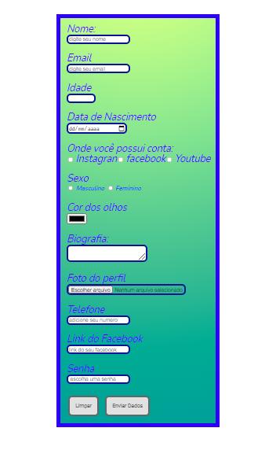

# LAYOUT CADASTRO#

### Segundo desafio usando HTML E CSS ###

### Ajustes e melhorias

O projeto ainda está em desenvolvimento e as próximas atualizações serão voltadas nas seguintes tarefas:

- [ ] Criação do HTML
- [X] Criação do CSS
- [x] Atualização do Layout

## 🤝 Colaboradores

<table>
  <tr>
    <td align="center">
      <a href="#">
         
        
          <b>Wenderson Farias</b>
        
      </a>
    </td>
  </tr>
</table>